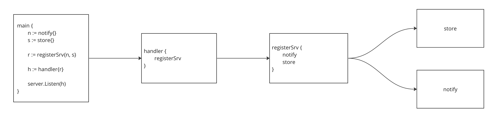

# go-sample-app



## Run
```
make run
```

## Test
```
make test
```

## Run Example
```
curl -v -H "Content-Type: application/json" -d '{"email": "sample@email.com", "password": "123456"}' http://localhost:8080/register
```
